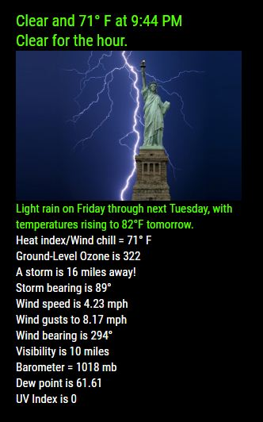

## MMM-WWI

**Weather Without Icons**

## But Mykle, why another weather module?

I enjoy doing this. I'm not trying to compete with the *real* geniuses here.
They are truly amazing and worthy of praise. I'm just having fun.
I'm still surprised that I can make *any* module work.
That's mostly due to the patience and generosity of my friend at the forum.
He is one of those genius types that I am talking about. :^)

## The information 

* Current conditions, temperature and time
* Conditions for the next hour
* A summary for the next 7 days
* Pictures of lightning events (1-13) if you want them
* Heat index/Wind chill temperature at this moment
* Nearest storm/weather event at this moment
* Bearing of the nearest storm/weather event at this moment
* Wind speed for your location at this moment
* Wind gusts speed for your location at this moment
* Wind bearing at this moment
* Visibility (in miles) at this moment
* Barometer reading at this moment (in millibars)
* DewPoint reading at this moment
* UV Index reading at this moment

## Examples



Annotated .css file included for aligning and coloring text and header.

## Installation and requirements

* `git clone https://github.com/mykle1/MMM-WWI` into the `~/MagicMirror/modules` directory.

* Free API key at `https://darksky.net/dev/register` using just your email.

* No dependencies needed! No kidding!


## Config.js entry and options

    {
		disabled: false,
		module: "MMM-WWI",
		position: "top_left",
		config: {
			apiKey: "YOUR API KEY GOES HERE", // Free API key @ https://darksky.net
			lat: "YOUR LATITUDE GOES HERE",   // Your latitude goes here
			lng: "YOUR LONGITUDE GOES HERE",  // Your longitude goes here
			pix: "4",                         // 1-13
			useHeader: false,                 // true if you want a header                 
			header: "Weather Without Icons",
			maxWidth: "300px",
		}
	},
	
## If you want icons

```
	var messageToYou = document.createElement("div");
	messageToYou.classList.add("U.R.xsmall", "notTooBright", "uglyToo");
if (you.want.icons && a.module.by.a.genius) {
	messageToYou.innerHTML = "Install MMM-NOAA instead";
}
	wrapper.appendChild(messageToYou);
```

## [Powered by Dark Sky](https://darksky.net/poweredby/)
